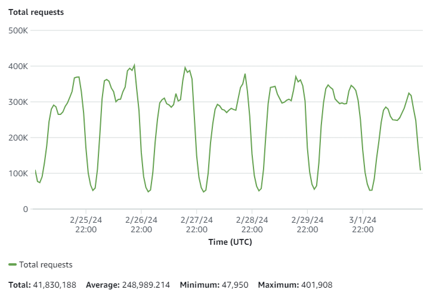

# visitData

`visitData` emulates the source, medium, campaign, content and term data just like Google Analytics does it (ga.js).

Since there is no way to extract this information from ga.js directly, you need a library like `visitData` to do it.

visitData is used on over 40 million page loads every week, just from the CDN:




## Questions / Contact

If you have any questions for this, drop me an email at [ilkkapel@gmail.com](mailto:ilkkapel@gmail.com)

## Include from cdn
:warning: note, the CDN location has changed. Read why from the [Announcement](https://github.com/ilkkapeltola/visitdata/discussions/3).

Here's the file you can include in your web page directly from CDN:
https://cdn.jsdelivr.net/npm/visitdata/dist/visitdata.umd.js

## Supported module formats

- CommonJS: https://cdn.jsdelivr.net/npm/visitdata/dist/visitdata.cjs.js
- UMD: https://cdn.jsdelivr.net/npm/visitdata/dist/visitdata.umd.js
- ESM: https://cdn.jsdelivr.net/npm/visitdata/dist/visitdata.esm.js

## Install with npm

```
npm install visitdata
```

## Build from source code

clone this repository and then

```sh
npm install
npm run build
```

## Usage

```html
<script src="https://cdn.jsdelivr.net/npm/visitdata/dist/visitdata.umd.js"></script>
<script>console.log(visitData.get());</script>

<!-- or, and this you can copy into a javascript console without the <script> tag too for testing -->

<script>
  await import('https://cdn.jsdelivr.net/npm/visitdata/dist/visitdata.umd.js')
  console.log(visitData.get())
</script>

```

`visitData.get()` will return an object like
```json
{
  "source": "google",
  "medium": "organic"
}
```

You can also run `visitData.rawData()` which will return a lot more information

The results are cached with sessionStorage, so subsequent page views in the same session will return the original result.

## Options

| option | what it does | value |
| -- | -- | -- |
| cache | disable caching | `true` or `false` |
| url_parameters | pick custom url parameters | e.g. ```{'utm_campaign': 'campaign', 'urlparam_custom': 'custom'}``` |

### cache
The first time `visitdata` `get()` or `rawData()` is called, the library will store the results into `sessionStorage`, so that subsequent pageviews in the same session will return the original results from cache.

During testing, or for some other reason, you might want to disable caching. You can do that by calling
```
visitData.setOption('cache', false)
```

### url_parameters

By default, `visitData` assumes your URL can have standard UTM parameters such as `utm_source`, `utm_medium`, `utm_campaign`, `utm_content` and `utm_term`. However, you might want to pick custom parameters additionally.

For example, let's say you actually want to track a `campaign_id` instead of `utm_campaign`. You might do something like this: 

```
visitData.setOption('url_parameters', {
    'utm_medium': 'medium',
    'utm_source': 'source',
    'utm_campaign': 'campaign',
    'campaign_id': 'campaign_id'
})
```

Now, calling `visitData.get()` will return an object like:

```
{
  'medium': 'cpc',
  'source: 'google',
  'campaign: 'My campaign',
  'campaign_id': '1241234'
}
```